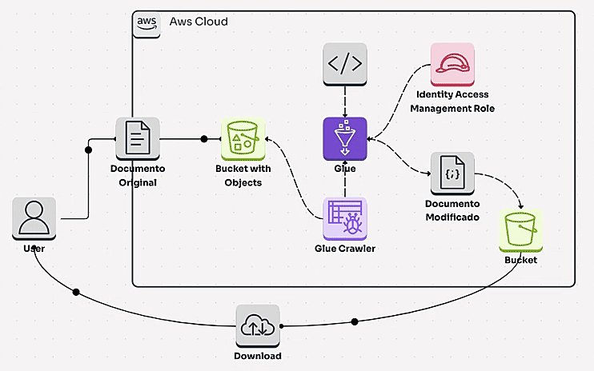

<!DOCTYPE html>
<html lang="en">
<head>
  <meta charset="UTF-8">
  <meta name="viewport" content="width=device-width, initial-scale=1.0">
</head>
<body>
  

    <header>
      <h1>Processamento e Transformação de Dados de Vendas Utilizando AWS Glue 📊</h1>
      
Este projeto demonstra como criar um pipeline de ETL utilizando AWS para transformar dados de vendas de e-commerce e carregá-los em um repositório central para análise.

    </header>
    <section>
      <h2>📋 O que foi feito?</h2>
      <h3>1️⃣ Extração e Transformação de Dados com AWS Glue:</h3>
      <ul>
        <li>Criei uma infraestrutura de processamento de dados utilizando o <strong>AWS Glue</strong>, incluindo:</li>
        <ul>
          <li><strong>Amazon S3:</strong> Armazenamento de dados brutos (arquivos CSV de vendas) e dados transformados.</li>
          <li><strong>AWS Glue Crawler:</strong> Utilizado para explorar e catalogar automaticamente os dados de vendas armazenados no S3. O Crawler identifica os formatos dos arquivos (CSV, JSON, etc.) e cria uma tabela no catálogo de dados do Glue.</li>
          <li><strong>AWS Glue ETL Job:</strong> Criação de um job de ETL para transformar os dados, incluindo:
            <ul>
              <li>Aplicação de 20% de desconto nos produtos baixados no arquivo CSV.</li>
              <li>Conversão de tipos de dados, como de string para inteiro e data em formato inválido para um formato correto.</li>
              <li>Remoção de registros inválidos ou duplicados.</li>
              <li>Cálculos de agregação (total de vendas por mês, produto e região).</li>
              <li>Agrupamento e organização dos dados.</li>
          </ul>
        </ul>
      </ul>
      <h3>2️⃣ Carregamento de Dados no S3:</h3>
      <ul>
        <li>Após a transformação dos dados, os dados prontos para análise foram carregados de volta para o <strong>Amazon S3</strong> em um formato eficiente para consulta, como CSV.</li>
      </ul>
      <h3>3️⃣ Automatização com AWS Glue:</h3>
      <ul>
        <li>Configurei o <strong>AWS Glue</strong> para a execução do job ETL, garantindo que os dados sejam processados e carregados automaticamente no S3.</li>
      </ul>
      <h3>4️⃣ Validação dos Dados:</h3>
      <ul>
        <li>Após o processamento, validei os dados para garantir que as transformações foram aplicadas corretamente, incluindo:</li>
        <ul>
          <li>Verificação do número de registros.</li>
          <li>Garantia de que os cálculos e transformações estavam corretos.</li>
          <li>Geração de um relatório simples para monitoramento.</li>
        </ul>
    </section>
    <footer>
      <h2>🚀 Resultado</h2>
      
      

      

      
O pipeline de ETL agora processa e transforma dados de vendas automaticamente, organizando-os em um formato .CSV pronto para análise no Amazon S3.

      <strong><a href=""_blank">Clique aqui para assistir o vídeo do passo a passo que postei no LinkedIn</a></strong>
      

      

      
Espero que curtam 😊

    </footer>
  

</body>
</html>
